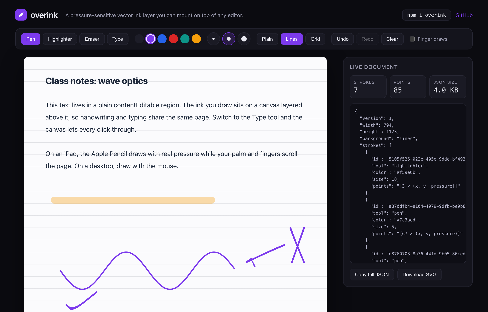

# overink

[](https://overink.vercel.app)

I wanted handwriting in a note-taking app I'm building, and every drawing library I tried took over the whole page. overink doesn't. It's a thin layer of ink you place on top of an editor you already have. You write by hand on the top layer and type on the one below, all on the same page.

It works over TipTap, ProseMirror, a plain text box, or anything else that shows up inside a container.

[](LICENSE)
[](https://www.typescriptlang.org/)
[](https://overink.vercel.app)

**[Try the demo](https://overink.vercel.app)**

```bash
npm i overink
```

## Why I built it

I'm building Scriva, an app for school notes, and it needed Apple Pencil writing that felt good on an iPad without me shipping a separate native app. The handwriting part had nothing to do with Scriva's accounts or its AI, so I split it into its own package and made it open source. What's left is just the ink.

One idea shaped the whole thing: the writing has to keep working offline and, someday, move to a native app without me rebuilding it. So each stroke is saved as data, not as an image.

## What you get

- Every stroke is saved as a list of points, in plain JSON. It stays sharp at any zoom, takes up almost no space, and turns into a clean image when you need to print or export.
- The Apple Pencil's pressure comes through, so lines get thicker when you press harder. It's tuned to feel like a gel pen, not a crayon.
- You decide what can draw. Pen and mouse by default, so resting your hand or scrolling with a finger won't leave marks. On iPad the Pencil keeps writing even when Safari tries to scroll instead.
- Writing feels immediate, with no visible lag between the Pencil and the ink.
- Pen, highlighter, and an eraser that only rubs out the part you touch, the way GoodNotes does it. Plus undo, redo, and blank, lined, or grid paper.
- The core is plain TypeScript with almost no dependencies. React components come built in, and if you use Vue or Svelte, wrapping it is a short job.

## Quick start (React)

```tsx
'use client'

import { useState } from 'react'
import { InkLayer, PaperBackground, createInkDocument } from 'overink/react'

export function Page() {
  const [doc, setDoc] = useState(() => createInkDocument({ background: 'lines' }))

  return (
    <div style={{ position: 'relative' }}>
      <PaperBackground kind={doc.background} />
      <MyEditor />
      <InkLayer value={doc} onChange={setDoc} tool="pen" color="#7c3aed" size={4} />
    </div>
  )
}
```

Give the container `position: relative` and the layer fills it. It sits above your editor, and when you set `tool="none"` every click and keystroke passes straight through to whatever is underneath.

## Quick start (without React)

Not using React? The core works on its own.

```ts
import { InkEngine, createInkDocument } from 'overink'

const engine = new InkEngine(document.querySelector('#page'), {
  document: createInkDocument(),
  tool: 'pen',
  color: '#1d1d28',
  onChange: doc => save(doc),
})

engine.setTool('highlighter')
engine.undo()
engine.destroy()
```

## The data format

A page of ink is a single JSON object.

```json
{
  "version": 1,
  "width": 794,
  "height": 1123,
  "background": "lines",
  "strokes": [
    {
      "id": "7d9c…",
      "tool": "pen",
      "color": "#7c3aed",
      "size": 4,
      "points": [112.5, 208.1, 0.62, 114.9, 209.3, 0.71]
    }
  ]
}
```

A few things worth knowing:

- Each point is three numbers: x, y, and how hard you pressed. Storing them as a plain list keeps files small, which matters when they save and sync on every change.
- Coordinates are measured against the page width, so the ink scales with the page and looks the same on any screen.
- overink saves the points you actually drew, not the smoothed line you see. The smoothing happens as it draws, so the same file can be reopened later, even by a native app, and still look right.
- Erasing removes strokes from the list. There is nothing extra to store.
- The `version` field lets me change the format later without breaking old notes.

## Reference

### `<InkLayer />` from `overink/react`

| Prop | Type | Default | What it does |
| --- | --- | --- | --- |
| `value` | `InkDocument` | | The current page of ink. Pass back what `onChange` gives you. |
| `defaultValue` | `InkDocument` | `createInkDocument()` | Where to start if you don't control it yourself. |
| `onChange` | `(doc: InkDocument) => void` | | Runs whenever a stroke is added, erased, undone, redone, or cleared. Not on every point. |
| `tool` | `'pen' \| 'highlighter' \| 'eraser' \| 'none'` | `'pen'` | `'none'` lets clicks and typing reach the editor underneath. |
| `color` | `string` | `'#1d1d28'` | Ink color. |
| `size` | `number` | `4` | How thick the stroke is. |
| `pointers` | `('pen' \| 'mouse' \| 'touch')[]` | `['pen', 'mouse']` | What is allowed to draw. Leave `'touch'` out and fingers scroll instead. |
| `readOnly` | `boolean` | `false` | Show the ink but don't accept new drawing. |
| `eraserRadius` | `number` | `12` | How big the eraser is, in pixels. |

The ref gives you `undo()`, `redo()`, `clear()`, `canUndo()`, `canRedo()`, and `getDocument()`.

### `<PaperBackground />`

Lined or grid paper, drawn with plain CSS. Put it under your editor so the lines sit behind your text. Options: `kind`, `spacing`, `lineColor`.

### `InkEngine` from `overink`

The core class behind `InkLayer`, for when you're not using React. You create it with a container and the same options as the React props. It has methods to change the tool, color, size, paper, and eraser size, and to undo, redo, clear, and clean up: `setDocument`, `getDocument`, `setTool`, `setColor`, `setSize`, `setPointers`, `setReadOnly`, `setBackground`, `setEraserRadius`, `undo`, `redo`, `clear`, `destroy`, plus `canUndo` and `canRedo`.

### `toSVG(doc)`

Turns a page of ink into an image you can drop into a PDF or anywhere else.

## How it fits together

```
┌ position: relative ────────────┐
│  <PaperBackground/>   z: back  │
│  <YourEditor/>                 │
│  <InkLayer/>          z: front │
│    ├─ base canvas  (finished)  │
│    └─ wet canvas   (live)      │
└────────────────────────────────┘
```

overink stacks two canvases over your editor. One holds the ink you've finished, the other shows the stroke you're drawing right now. Only the second one redraws as you write, which is what keeps it fast. Lift the pen and the stroke moves to the finished layer and gets handed to your `onChange`. Both canvases resize on their own when your editor grows.

## Running it locally

The repo is an npm workspace. The package sits in [`packages/overink`](packages/overink), the demo in [`playground`](playground).

```bash
npm install
npm run dev      # builds the package, then runs the playground on :3000
npm run build    # builds both
```

## License

MIT. Built by Juan José Zepeda.
